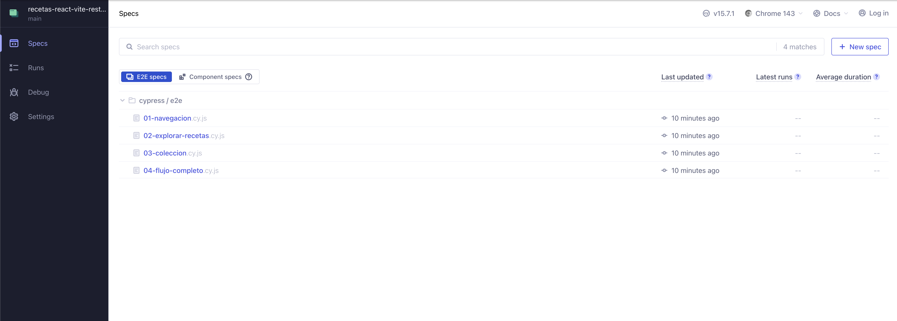
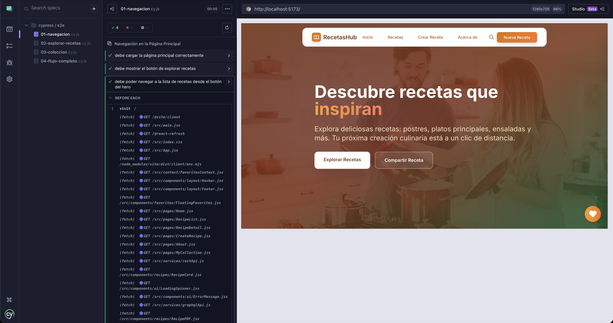
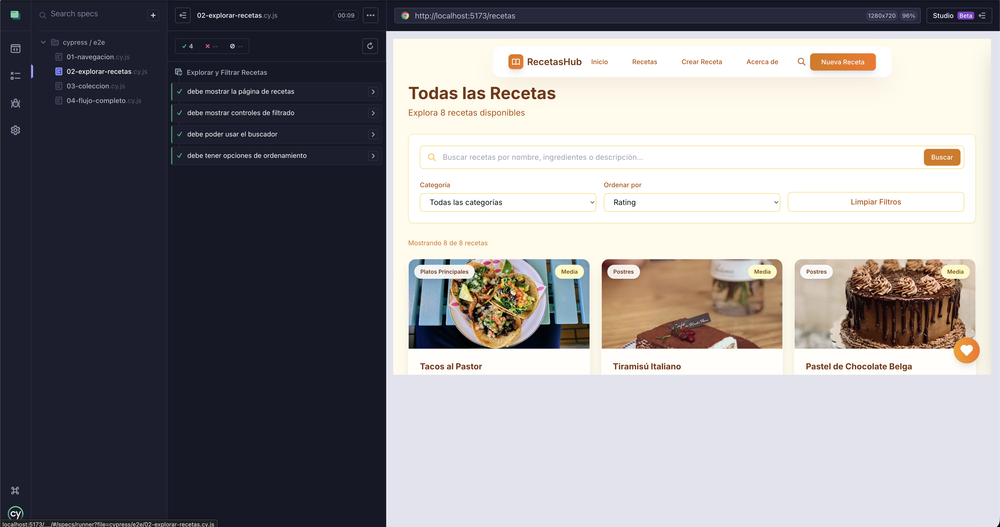
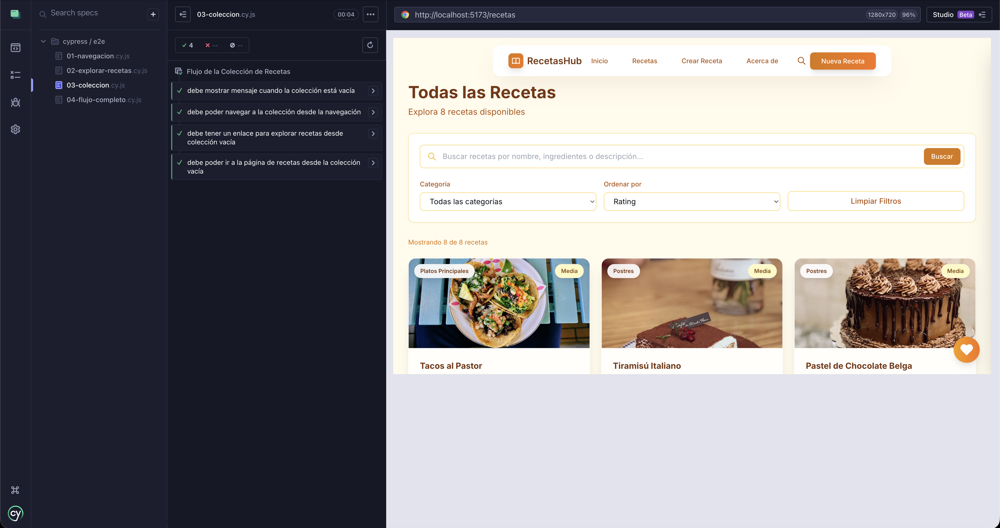
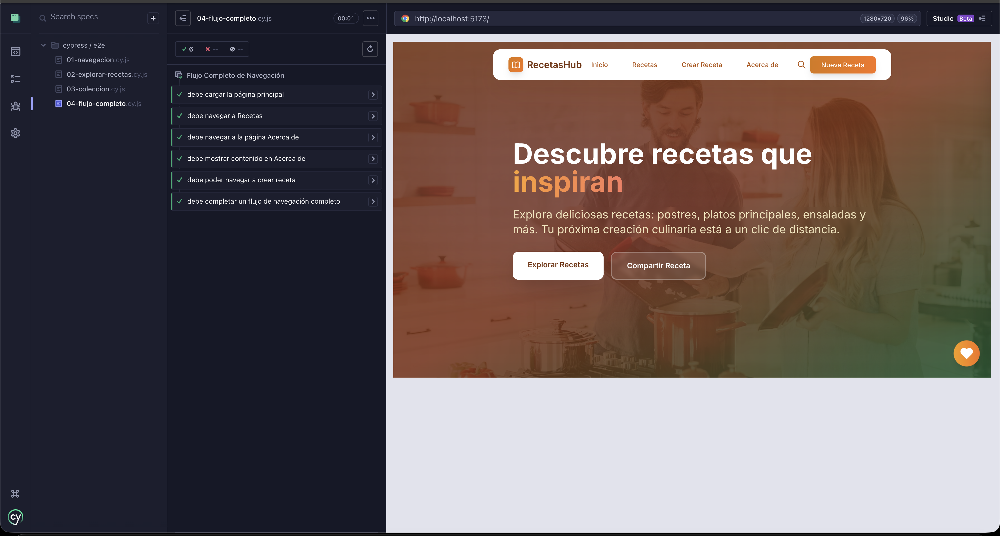
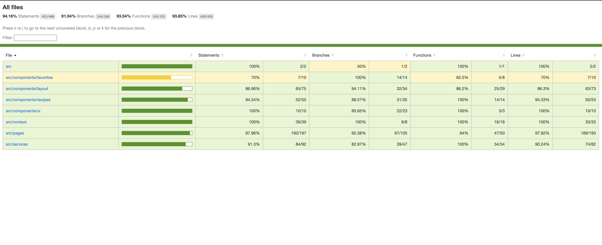

<div align="center">

# 🍳 RecetasHub

### Plataforma de Gestión y Descubrimiento de Recetas

[](https://react.dev/)
[](https://vitejs.dev/)
[](https://tailwindcss.com/)
[](https://graphql.org/)
[](/)
[](https://www.cypress.io/)
[](LICENSE)

<br />

**RecetasHub** es una aplicación web moderna construida con React y Vite que permite descubrir, explorar y gestionar recetas de cocina. Cuenta con una arquitectura híbrida REST + GraphQL, sistema de favoritos con persistencia local, y más del 94% de cobertura en testing.

[Demo en Vivo](https://rodrigosanchezdev.github.io/recetas-react-vite-rest-graphql/) · [Reportar Bug](mailto:Rodrigo@sanchezdev.com) · [Solicitar Feature](mailto:Rodrigo@sanchezdev.com)

</div>

---

## 📑 Tabla de Contenidos

- [Características](#-características)
- [Stack Tecnológico](#-stack-tecnológico)
- [Arquitectura](#-arquitectura)
- [Instalación](#-instalación)
- [Uso](#-uso)
- [APIs](#-documentación-de-apis)
- [Testing](#-testing)
- [Cobertura](#-cobertura-de-código)
- [Licencia](#-licencia)
- [Autor](#-autor)

---

## ✨ Características

<table>
<tr>
<td width="50%">

### 🔍 Exploración de Recetas
- Búsqueda inteligente por nombre, ingrediente o categoría
- Filtros avanzados por dificultad y tiempo de cocción
- Ordenamiento por rating, tiempo o nombre
- Vista de detalle con información completa

</td>
<td width="50%">

### 📚 Gestión de Colección
- Sistema de favoritos con persistencia local
- Panel flotante de acceso rápido
- Página dedicada de "Mi Colección"
- Exportación de recetas a formato visual

</td>
</tr>
<tr>
<td width="50%">

### 👨‍🍳 Creación de Recetas
- Formulario intuitivo multi-paso
- Gestión dinámica de ingredientes
- Instrucciones paso a paso
- Categorización y metadatos completos

</td>
<td width="50%">

### 🎨 Experiencia de Usuario
- Diseño responsivo mobile-first
- Animaciones fluidas y transiciones
- Estados de carga optimizados
- Manejo de errores amigable

</td>
</tr>
</table>

---

## 🛠️ Stack Tecnológico

### Core
| Tecnología | Versión | Descripción |
|------------|---------|-------------|
|  | 19.2.0 | Biblioteca de UI con hooks y context |
|  | 7.2.4 | Build tool con HMR ultrarrápido |
|  | 7.9.6 | Enrutamiento declarativo SPA |
|  | 3.4.15 | Framework CSS utility-first |

### APIs & Data Layer
| Tecnología | Descripción |
|------------|-------------|
|  | Operaciones CRUD y listados |
|  | Consultas de datos relacionados |
|  | Mock Service Worker para desarrollo |

### Testing & Quality
| Herramienta | Cobertura | Descripción |
|-------------|-----------|-------------|
|  | 94.16% | Tests unitarios y de integración |
|  | - | Testing de componentes React |
|  | 4 suites | Tests end-to-end |
|  | - | Linting y code quality |

---

## 📁 Arquitectura

```
recetas-react-vite-rest-graphql/
├── cypress/
│   ├── e2e/                          # Tests E2E
│   │   ├── 01-navegacion.cy.js       # Tests de navegación
│   │   ├── 02-explorar-recetas.cy.js # Tests de exploración
│   │   ├── 03-coleccion.cy.js        # Tests de colección
│   │   └── 04-flujo-completo.cy.js   # Tests de flujo completo
│   └── support/                      # Configuración Cypress
├── src/
│   ├── components/
│   │   ├── favorites/
│   │   │   └── FloatingFavorites.jsx # Drawer de favoritos
│   │   ├── events/
│   │   │   ├── EventCard.jsx         # Card de evento/receta
│   │   │   └── RecipePDF.jsx         # Visualización PDF
│   │   ├── layout/
│   │   │   ├── Navbar.jsx            # Navegación con búsqueda
│   │   │   └── Footer.jsx            # Footer responsive
│   │   └── ui/
│   │       ├── EmptyState.jsx        # Estado vacío reutilizable
│   │       ├── ErrorMessage.jsx      # Manejo de errores
│   │       └── LoadingSpinner.jsx    # Indicador de carga
│   ├── context/
│   │   └── FavoritesContext.jsx      # Estado global de favoritos
│   ├── data/
│   │   └── events.json               # Datos mock de recetas
│   ├── mocks/
│   │   ├── browser.js                # MSW browser config
│   │   ├── handlers.js               # Handlers REST + GraphQL
│   │   └── server.js                 # MSW server config
│   ├── pages/
│   │   ├── Home.jsx                  # Landing page
│   │   ├── EventList.jsx             # Listado con filtros
│   │   ├── EventDetail.jsx           # Detalle completo
│   │   ├── CreateEvent.jsx           # Formulario de creación
│   │   ├── MyCollection.jsx          # Colección de favoritos
│   │   └── About.jsx                 # Página institucional
│   ├── services/
│   │   ├── restApi.js                # Cliente REST API
│   │   └── graphqlApi.js             # Cliente GraphQL
│   ├── App.jsx                       # Componente raíz
│   └── main.jsx                      # Entry point
├── tests/
│   ├── components/                   # Tests de componentes
│   ├── context/                      # Tests de context
│   ├── pages/                        # Tests de páginas
│   ├── services/                     # Tests de servicios
│   └── test-utils.jsx                # Utilidades de testing
├── cypress.config.js                 # Configuración Cypress
├── vite.config.js                    # Configuración Vite
├── tailwind.config.js                # Configuración Tailwind
└── package.json
```

---

## 🚀 Instalación

### Prerrequisitos

- Node.js 18.x o superior
- npm 9.x o superior

### Pasos

```bash
# Clonar el repositorio
git clone https://github.com/RodrigoSanchezDev/recetas-react-vite-rest-graphql.git

# Acceder al directorio
cd recetas-react-vite-rest-graphql

# Instalar dependencias
npm install

# Iniciar servidor de desarrollo
npm run dev
```

La aplicación estará disponible en `http://localhost:5173`

### Scripts Disponibles

| Comando | Descripción |
|---------|-------------|
| `npm run dev` | Servidor de desarrollo con HMR |
| `npm run build` | Build de producción |
| `npm run preview` | Preview del build |
| `npm run lint` | Ejecutar ESLint |
| `npm run test` | Tests en modo watch |
| `npm run test:run` | Tests en modo CI |
| `npm run test:coverage` | Tests con reporte de cobertura |
| `npm run cypress:open` | Cypress en modo interactivo |
| `npm run cypress:run` | Cypress en modo headless |

---

## 📖 Uso

### Explorar Recetas

1. Navega a `/recetas` para ver el catálogo completo
2. Utiliza la barra de búsqueda para filtrar por nombre o ingrediente
3. Aplica filtros de categoría y ordenamiento
4. Haz clic en una receta para ver sus detalles

### Gestionar Favoritos

1. En cualquier receta, haz clic en el ícono de corazón
2. Accede a tu colección desde el botón flotante
3. Visita `/mi-coleccion` para ver todas tus recetas guardadas

### Crear Recetas

1. Navega a `/crear-receta`
2. Completa los campos requeridos (título, descripción, ingredientes)
3. Añade las instrucciones de preparación
4. Selecciona categoría, dificultad y tiempo de cocción

---

## 📚 Documentación de APIs

### REST API

```javascript
// GET - Obtener todas las recetas
const recipes = await restApi.getRecipes();
// Response: { success: true, data: [...] }

// GET - Obtener receta por ID
const recipe = await restApi.getRecipeById(id);
// Response: { success: true, data: {...} }

// GET - Buscar recetas
const results = await restApi.searchRecipes(query);
// Response: { success: true, data: [...] }

// GET - Obtener categorías
const categories = await restApi.getCategories();
// Response: { success: true, data: [...] }

// POST - Crear receta
const newRecipe = await restApi.createRecipe(recipeData);
// Response: { success: true, data: {...} }
```

### GraphQL API

```graphql
# Query - Obtener detalles completos de receta
query GetRecipeDetails($id: ID!) {
  recipe(id: $id) {
    id
    title
    description
    ingredients
    preparation
    cookingTime
    servings
    difficulty
    rating
    category
    image
    nutritionalInfo {
      calories
      protein
      carbs
      fat
    }
  }
}

# Query - Obtener recetas por categoría
query GetRecipesByCategory($category: String!) {
  recipesByCategory(category: $category) {
    id
    title
    image
    rating
    cookingTime
  }
}
```

---

## 🧪 Testing

### Tests Unitarios y de Integración

El proyecto utiliza **Vitest** con **React Testing Library** para pruebas de componentes:

```bash
# Ejecutar todos los tests
npm run test:run

# Ejecutar con interfaz visual
npm run test:ui

# Ejecutar con cobertura
npm run test:coverage
```

### Tests End-to-End

El proyecto incluye 4 suites de tests E2E con **Cypress**:

<div align="center">



*Panel de Cypress mostrando las 4 suites de tests E2E*

</div>

| Suite | Archivo | Descripción |
|-------|---------|-------------|
| Navegación | `01-navegacion.cy.js` | Tests de navegación principal y rutas |
| Exploración | `02-explorar-recetas.cy.js` | Tests de búsqueda y filtrado |
| Colección | `03-coleccion.cy.js` | Tests del sistema de favoritos |
| Flujo Completo | `04-flujo-completo.cy.js` | Tests de flujos de usuario completos |

```bash
# Abrir Cypress en modo interactivo
npm run cypress:open

# Ejecutar tests en modo headless
npm run cypress:run
```

#### Resultados de Tests E2E

<details>
<summary>📍 <strong>Test de Navegación</strong> - Verificación de rutas y navegación</summary>
<br />



</details>

<details>
<summary>🔍 <strong>Test de Exploración</strong> - Búsqueda y filtrado de recetas</summary>
<br />



</details>

<details>
<summary>📚 <strong>Test de Colección</strong> - Sistema de favoritos</summary>
<br />



</details>

<details>
<summary>🔄 <strong>Test de Flujo Completo</strong> - Flujos de usuario end-to-end</summary>
<br />



</details>

---

## 📊 Cobertura de Código

El proyecto mantiene una cobertura de código superior al **94%**:

<div align="center">



*Reporte de cobertura generado con Vitest + V8*

</div>
| Métrica | Cobertura |
|---------|-----------|
| **Statements** | 94.16% |
| **Branches** | 91.04% |
| **Functions** | 93.54% |
| **Lines** | 93.85% |

### Desglose por Módulo

| Módulo | Stmts | Branch | Funcs | Lines |
|--------|-------|--------|-------|-------|
| Components | 90%+ | 94%+ | 86%+ | 90%+ |
| Context | 100% | 100% | 100% | 100% |
| Pages | 97%+ | 92%+ | 94%+ | 97%+ |
| Services | 91%+ | 82%+ | 100% | 90%+ |

---

## 📄 Licencia

Este proyecto está bajo la Licencia MIT. Ver el archivo [LICENSE](LICENSE) para más detalles.

---

## 👨‍💻 Autor

<div align="center">

### Rodrigo Sánchez

**Full Stack Developer**

[](https://sanchezdev.com/)
[](mailto:Rodrigo@sanchezdev.com)
[](https://www.linkedin.com/in/sanchezdev)
[](https://www.sanchezdev.com/documents/CV-Espanol.html)
[](https://www.sanchezdev.com/es/agenda)

<br />

¿Tienes una idea de proyecto? [Conversemos cómo puedo ayudarte.](https://www.sanchezdev.com/es/agenda)

</div>

---

<div align="center">

**RecetasHub** · Desarrollado con React + Vite

</div>
