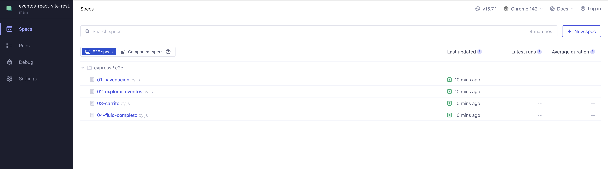
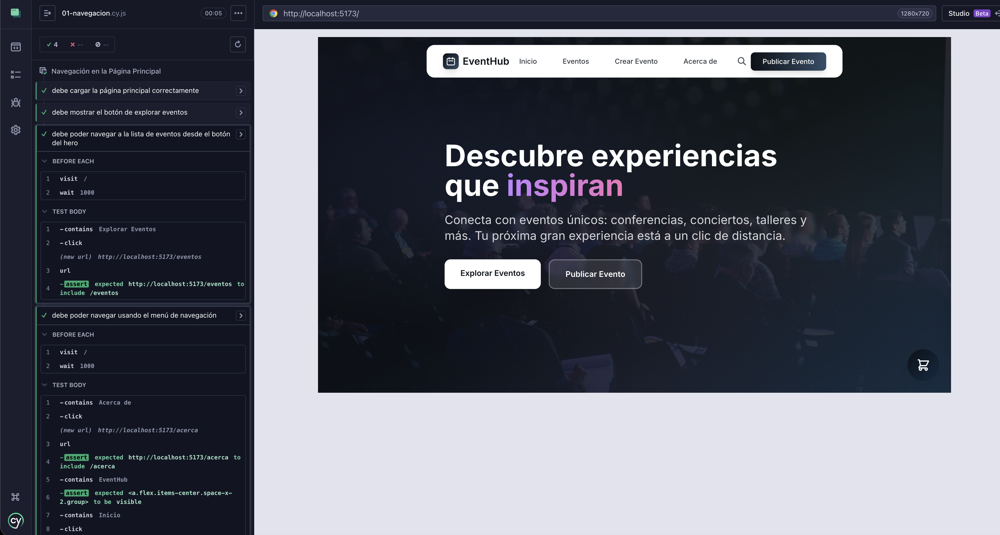
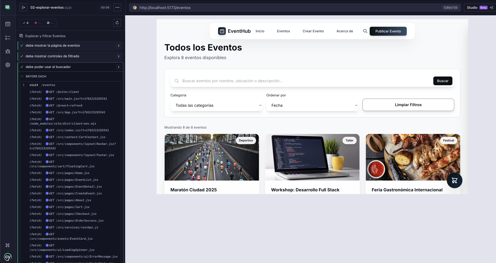
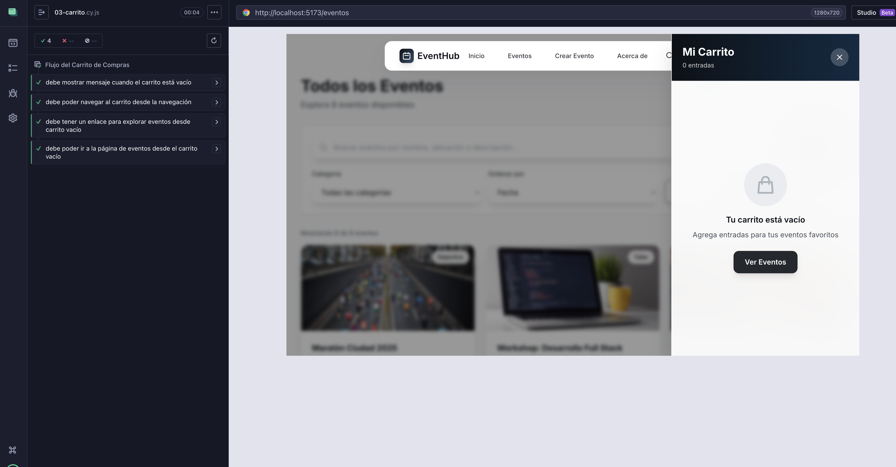
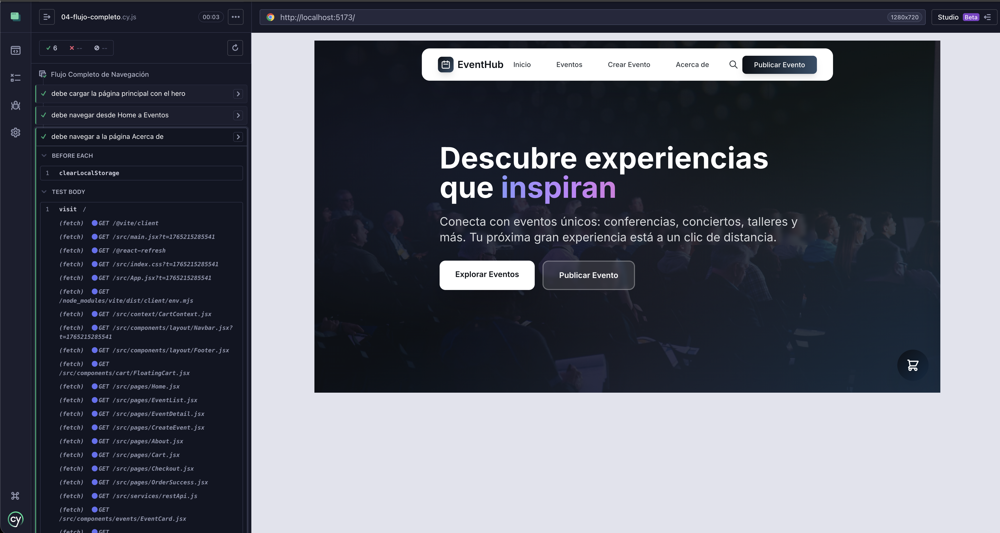

<div align="center">

# 🎫 EventHub

### Plataforma Profesional de Gestión y Descubrimiento de Eventos

[](https://react.dev/)
[](https://vitejs.dev/)
[](https://tailwindcss.com/)
[](https://reactrouter.com/)
[](https://vitest.dev/)
[](https://www.cypress.io/)
[]()
[](LICENSE)

**EventHub** es una plataforma web de última generación diseñada para revolucionar la forma en que las personas descubren, exploran y crean eventos. Con una arquitectura moderna y una interfaz intuitiva, conecta organizadores con audiencias de manera eficiente y profesional.

[🚀 Ver Demo en Vivo](https://rodrigosanchezdev.github.io/eventos-react-vite-rest-graphql/) · [Reportar Bug](https://github.com/RodrigoSanchezDev/eventos-react-vite-rest-graphql/issues) · [Solicitar Feature](https://github.com/RodrigoSanchezDev/eventos-react-vite-rest-graphql/issues)

</div>

---

## 📑 Tabla de Contenidos

- [Características](#-características-principales)
- [Tecnologías](#-stack-tecnológico)
- [Arquitectura](#-arquitectura-del-proyecto)
- [Instalación](#-instalación-rápida)
- [Arquitectura Técnica](#-arquitectura-técnica)
- [Uso](#-uso)
- [API Documentation](#-documentación-de-apis)
- [Componentes](#-componentes-principales)
- [Testing Unitario](#-testing-unitario)
- [Testing E2E](#-testing-e2e-con-cypress)
- [Testing de Compatibilidad](#-testing-de-compatibilidad)
- [Roadmap](#-roadmap)
- [Contribución](#-contribución)
- [Licencia](#-licencia)
- [Autor](#-autor)

---

## ✨ Características Principales

<table>
<tr>
<td width="50%">

### 🎯 Para Usuarios
- **Exploración Intuitiva**: Navegación fluida con búsqueda avanzada
- **Buscador Inteligente**: Busca por categoría en el navbar
- **Carrito de Compras**: Agrega eventos y gestiona tu compra
- **Filtros Avanzados**: Por categoría, fecha, precio y ubicación
- **Detalles Completos**: Información exhaustiva de cada evento
- **Diseño Responsivo**: Experiencia perfecta en todos los dispositivos
- **Checkout Completo**: Proceso de compra en 3 pasos

</td>
<td width="50%">

### 📝 Para Organizadores
- **Creación Simplificada**: Formulario intuitivo de publicación
- **Gestión Completa**: Panel de control de eventos
- **Estadísticas**: Métricas de rendimiento en tiempo real
- **Validación Automática**: Sistema de validación de datos
- **Publicación Instantánea**: Tu evento visible al momento

</td>
</tr>
</table>

### 🚀 Características Técnicas

- ⚡ **Alto Rendimiento**: Carga ultrarrápida con Vite
- 🔄 **Arquitectura Moderna**: React 19 con Hooks avanzados
- 🎨 **UI/UX Profesional**: Diseño glassmórfico con bento grids
- 📱 **Mobile First**: Optimizado para dispositivos móviles
- 🔌 **APIs Duales**: Integración REST y GraphQL con MSW
- 🛒 **Carrito de Compras**: Sistema completo con localStorage
- 🔍 **Búsqueda Inteligente**: Filtrado en tiempo real por categorías
- 🧪 **Testing Completo**: 205+ tests unitarios con 90%+ de cobertura (Vitest)
- 🎭 **Testing E2E**: 4 suites de pruebas end-to-end con Cypress
- 🎭 **Componentes Reutilizables**: Arquitectura modular escalable
- 🔒 **Type Safe**: Validación de datos en tiempo real
- ♿ **Accesible**: Cumple estándares WCAG

---

## 🛠 Stack Tecnológico

### Frontend Core
```
React 19.2.0          → Framework UI de última generación
Vite 7.2.4            → Build tool de alta velocidad
React Router DOM 6.x  → Enrutamiento SPA profesional
```

### Styling & UI
```
Tailwind CSS 3.4      → Framework CSS utility-first
Google Fonts (Inter)  → Tipografía profesional
Custom Components     → Sistema de diseño propietario
```

### Backend Mock & APIs
```
MSW (Mock Service Worker) → Interceptación de peticiones HTTP
REST API              → Endpoints mock para operaciones CRUD
GraphQL API           → Queries avanzadas con datos extendidos
JSON Data Store       → Persistencia local de datos
```

### Testing & Quality
```
Vitest 4.0.14             → Test runner ultrarrápido (compatible con Jest)
Cypress 15.7              → Framework de testing E2E
React Testing Library     → Testing de componentes React
@testing-library/jest-dom → Matchers adicionales para DOM
MSW (Mock Service Worker) → Mock de APIs REST y GraphQL
@vitest/coverage-v8       → Reportes de cobertura de código
```

### Tooling & Development
```
ESLint               → Linting y calidad de código
PostCSS              → Procesamiento CSS avanzado
NPM                  → Gestión de dependencias
Git                  → Control de versiones
```

---

## 📁 Arquitectura del Proyecto

```
eventos-react-vite-rest-graphql/
│
├── 📂 src/
│   │
│   ├── 📂 components/              # Componentes reutilizables
│   │   ├── 📂 cart/
│   │   │   └── FloatingCart.jsx   # Carrito flotante con panel deslizante
│   │   ├── 📂 events/
│   │   │   ├── EventCard.jsx      # Tarjeta de evento con botón de carrito
│   │   │   └── 📂 __tests__/      # Tests de EventCard
│   │   ├── 📂 layout/
│   │   │   ├── Navbar.jsx         # Navbar con buscador inteligente
│   │   │   ├── Footer.jsx         # Footer con enlaces y redes sociales
│   │   │   └── 📂 __tests__/      # Tests de Navbar y Footer
│   │   └── 📂 ui/
│   │       ├── LoadingSpinner.jsx # Componente de carga animado
│   │       ├── ErrorMessage.jsx   # Manejo de errores UX-friendly
│   │       ├── EmptyState.jsx     # Estados vacíos informativos
│   │       └── 📂 __tests__/      # Tests de componentes UI
│   │
│   ├── 📂 context/                 # Context API
│   │   ├── CartContext.jsx        # Estado global del carrito
│   │   └── 📂 __tests__/          # Tests del CartContext
│   │
│   ├── 📂 pages/                   # Páginas de la aplicación
│   │   ├── Home.jsx               # Landing con hero y bento grid stats
│   │   ├── EventList.jsx          # Lista con búsqueda y filtros
│   │   ├── EventDetail.jsx        # Vista detallada con selector cantidad
│   │   ├── CreateEvent.jsx        # Formulario de creación
│   │   ├── About.jsx              # Información con diseño impactante
│   │   ├── Cart.jsx               # Página del carrito de compras
│   │   ├── Checkout.jsx           # Proceso de pago en 3 pasos
│   │   └── OrderSuccess.jsx       # Confirmación de compra
│   │
│   ├── 📂 services/                # Capa de servicios con MSW
│   │   ├── restApi.js             # REST API con fetch a /api/*
│   │   ├── graphqlApi.js          # GraphQL API con fetch a /graphql
│   │   └── 📂 __tests__/          # Tests de servicios API
│   │
│   ├── 📂 mocks/                   # Mock Service Worker
│   │   ├── handlers.js            # Handlers REST y GraphQL
│   │   ├── browser.js             # Configuración MSW navegador
│   │   └── 📂 backup/             # Archivos legacy (respaldo)
│   │
│   ├── 📂 data/                    # Fuente de datos
│   │   └── events.json            # Dataset de 8+ eventos
│   │
│   ├── 📂 test/                    # Configuración de testing
│   │   ├── setup.js               # Setup global de Vitest
│   │   └── test-utils.jsx         # Utilidades de testing personalizadas
│   │
│   ├── App.jsx                     # Componente raíz con routing
│   ├── main.jsx                    # Entry point de la aplicación
│   └── index.css                   # Estilos globales + Tailwind
│
├── 📂 public/                      # Assets estáticos
├── 📄 index.html                   # HTML template
├── 📄 package.json                 # Dependencias del proyecto
├── 📄 tailwind.config.js           # Configuración Tailwind personalizada
├── 📄 postcss.config.js            # Configuración PostCSS
├── 📄 vite.config.js               # Configuración Vite + Vitest
├── 📂 coverage/                    # Reportes de cobertura (generado)
├── 📂 cypress/                     # Tests End-to-End
│   ├── 📂 e2e/                    # Archivos de pruebas E2E
│   │   ├── 01-navegacion.cy.js   # Tests de navegación
│   │   ├── 02-explorar-eventos.cy.js # Tests de exploración
│   │   ├── 03-carrito.cy.js      # Tests del carrito
│   │   └── 04-flujo-completo.cy.js # Tests de flujo completo
│   └── 📂 support/                # Configuración y comandos
├── 📄 cypress.config.js            # Configuración de Cypress
└── 📄 README.md                    # Este archivo
```

---

## 🚀 Instalación Rápida

### Prerrequisitos

Asegúrate de tener instalado:
- **Node.js** `18.0.0` o superior
- **npm** `9.0.0` o superior

### Pasos de Instalación

```bash
# 1. Clonar el repositorio
git clone https://github.com/tu-usuario/eventhub.git

# 2. Navegar al directorio
cd eventos-react-vite-rest-graphql

# 3. Instalar dependencias
npm install

# 4. Iniciar servidor de desarrollo
npm run dev
```

La aplicación estará disponible en `http://localhost:5173`

### Scripts Disponibles

```bash
npm run dev           # Servidor de desarrollo con HMR
npm run build         # Build de producción optimizado
npm run preview       # Preview del build de producción
npm run lint          # Ejecutar ESLint
npm test              # Ejecutar tests unitarios en modo watch
npm run test:run      # Ejecutar tests unitarios una vez
npm run test:coverage # Ejecutar tests con reporte de cobertura
npm run cypress:open  # Abrir Cypress para tests E2E (visual)
npm run cypress:run   # Ejecutar tests E2E en terminal
npm run e2e           # Alias para cypress:run
npm run e2e:open      # Alias para cypress:open
```

---

## 🏗️ Arquitectura Técnica

### ✅ React Router - Navegación SPA

**Configuración completa de enrutamiento** con React Router DOM 6.x para navegación fluida sin recargas:

**📋 Implementación:**
- ✅ **8 rutas** configuradas en `App.jsx` con componente `<Routes>` y `<Route>`
- ✅ **Navegación sin errores**: Uso correcto de `<Link>` y `useNavigate` para navegación programática
- ✅ **Rutas dinámicas**: `/eventos/:id` con parámetros URL usando `useParams`
- ✅ **basename configurado**: Soporte para GitHub Pages con subfolder routing
- ✅ **Layout persistente**: Navbar y Footer se mantienen en todas las vistas

**📍 Código:** `src/App.jsx` - `<BrowserRouter>` con todas las rutas

---

### ✅ Componentes Reutilizables - Arquitectura Modular

**Código organizado en componentes** con separación clara de responsabilidades:

**📋 Estructura modular:**
- ✅ **Componentes UI**: `LoadingSpinner`, `ErrorMessage`, `EmptyState` (reutilizables en todo el proyecto)
- ✅ **Componentes de Layout**: `Navbar`, `Footer` (compartidos entre todas las páginas)
- ✅ **Componentes de Negocio**: `EventCard`, `FloatingCart` (lógica específica encapsulada)
- ✅ **Páginas**: 8 páginas independientes en `src/pages/`
- ✅ **Props bien definidas**: Cada componente recibe props tipadas y documentadas

**📍 Estructura:**
```
src/components/
  ├── ui/           → Componentes reutilizables genéricos
  ├── layout/       → Componentes de estructura común
  ├── events/       → Componentes específicos de eventos
  └── cart/         → Componentes del sistema de carrito
```

---

### ✅ Manejo de Estado - Hooks de React

**Gestión de estado reactivo** con hooks nativos para actualización fluida de la UI:

**📋 Implementación:**
- ✅ **useState**: Manejo de estado local en todos los componentes (loading, error, data)
- ✅ **useEffect**: Carga de datos al montar componentes y sincronización con APIs
- ✅ **Context API**: Estado global del carrito con `CartContext` (compartido entre componentes)
- ✅ **Custom Hooks**: `useCart()` para acceder al contexto del carrito
- ✅ **localStorage**: Persistencia del carrito entre sesiones

**📍 Ejemplos clave:**
- `src/pages/Home.jsx` - useEffect para cargar eventos y stats
- `src/context/CartContext.jsx` - Context + useState para carrito global
- `src/pages/EventDetail.jsx` - useState para cantidad, useParams para ID

---

## 💻 Uso

### Navegación Principal

```javascript
/                    → Página de inicio con eventos destacados y stats
/eventos             → Lista completa con búsqueda y filtros
/eventos/:id         → Detalles completos del evento con selector cantidad
/crear-evento        → Formulario de creación de eventos
/acerca              → Información sobre la plataforma
/cart                → Carrito de compras con resumen
/checkout            → Proceso de pago en 3 pasos
/order-success       → Confirmación de compra exitosa
```

### Buscador Inteligente en Navbar

- **Panel Modal**: Búsqueda flotante con backdrop blur
- **Filtro por Categorías**: Pills interactivos para 8 categorías
- **Búsqueda en Tiempo Real**: Filtra mientras escribes
- **Vista de Resultados**: Tarjetas con imagen, info y precio
- **Navegación Directa**: Click en resultado va al detalle
- **Responsive**: Funciona perfecto en móvil y desktop

### Sistema de Carrito de Compras

- **FloatingCart**: Botón flotante con badge de cantidad
- **Panel Deslizante**: Vista rápida desde cualquier página
- **Gestión Completa**: Agregar, quitar, modificar cantidad
- **Persistencia**: Datos guardados en localStorage
- **Checkout en 3 Pasos**: Personal → Pago → Facturación
- **Confirmación**: Página de éxito con detalles del pedido

### Creación de Eventos

1. Navega a `/crear-evento`
2. Completa el formulario con los datos del evento
3. Opcionalmente añade una URL de imagen
4. Haz clic en "Publicar Evento"
5. Serás redirigido a la lista de eventos

---

## 📡 Documentación de APIs

### ✅ Implementación de API REST Mock

El proyecto implementa una **API REST mock completa** que simula un servidor real utilizando **Mock Service Worker (MSW)**:

**📋 Características principales:**
- ✅ **7 endpoints REST** operativos (GET, POST) para operaciones CRUD
- ✅ **Datos dinámicos** cargados desde `src/data/events.json`
- ✅ **Respuestas realistas** con delays de red (200-500ms) y códigos HTTP (200, 201, 404)
- ✅ **Modo dual**: MSW en desarrollo, datos estáticos en producción (GitHub Pages)
- ✅ **Sin errores**: Interfaz consume la API sin errores de carga

**🔧 Arquitectura:**
```
Componente → restApi.js (cliente) → MSW intercepta → handlers.js (mock server) → JSON data
```

**📍 Ubicación del código:**
- `src/services/restApi.js` - Cliente HTTP con fetch()
- `src/mocks/handlers.js` - Handlers MSW para desarrollo
- `src/data/events.json` - Fuente de datos

---

### REST API con MSW

**MSW (Mock Service Worker)** intercepta peticiones HTTP reales a `/api/*`

Ubicación: 
- `src/services/restApi.js` - Cliente API
- `src/mocks/handlers.js` - Handlers MSW

#### Endpoints Disponibles

```javascript
// GET /api/events - Obtener todos los eventos
await fetch('/api/events')
// Retorna: { success: true, data: Array<Event> }

// GET /api/events/:id - Obtener evento por ID  
await fetch('/api/events/1')
// Retorna: { success: true, data: Event } o { success: false } (404)

// GET /api/events/category/:category - Filtrar por categoría
await fetch('/api/events/category/Conferencia')
// Retorna: { success: true, data: Array<Event> }

// GET /api/search?q=query - Buscar eventos
await fetch('/api/search?q=tech')
// Retorna: { success: true, data: Array<Event>, count: number }

// POST /api/events - Crear nuevo evento
await fetch('/api/events', { method: 'POST', body: JSON.stringify(event) })
// Retorna: { success: true, data: Event, message: string } (201)

// GET /api/stats - Estadísticas generales
await fetch('/api/stats')
// Retorna: { success: true, data: { totalEvents, categories, totalSeats, averagePrice } }
```

**Características MSW:**
- ✅ Delay de red realista (200-500ms)
- ✅ Códigos HTTP correctos (200, 201, 404, 500)
- ✅ Peticiones fetch reales interceptadas
- ✅ Solo activo en desarrollo
- ✅ Logs en consola del navegador

---

### ✅ Implementación de API GraphQL Mock

El proyecto implementa **consultas GraphQL mock** para obtener información detallada y específica de eventos:

**📋 Características principales:**
- ✅ **4 queries GraphQL** operativas para consultas avanzadas
- ✅ **Consultas flexibles**: Solo solicita los campos necesarios (evita over-fetching)
- ✅ **Información detallada**: Detalles completos de eventos, asistentes, organizadores
- ✅ **Sin errores**: Cliente GraphQL funciona correctamente en desarrollo y producción
- ✅ **Modo dual**: MSW en desarrollo, fallback a datos estáticos en producción

**🔧 Ventaja sobre REST:**
GraphQL permite solicitar exactamente los datos necesarios en una sola petición, evitando múltiples llamadas REST.

**📍 Ubicación del código:**
- `src/services/graphqlApi.js` - Cliente GraphQL con queries predefinidos
- `src/mocks/handlers.js` - Handlers GraphQL para desarrollo

---

### GraphQL API con MSW

**MSW** intercepta peticiones GraphQL POST a `/graphql`

Ubicación:
- `src/services/graphqlApi.js` - Cliente GraphQL
- `src/mocks/handlers.js` - Handlers GraphQL

#### Queries Disponibles

```graphql
# Obtener detalles completos del evento
query GetEventDetails($id: ID!) {
  event(id: $id) {
    id, title, date, time, location, category
    description, price, availableSeats
  }
}

# Buscar eventos por organizador
query SearchByOrganizer($organizer: String!) {
  events(organizer: $organizer) {
    id, title, date, location
  }
}

# Información de asistentes
query GetAttendees($eventId: ID!) {
  attendees(eventId: $eventId) {
    total, availableSeats, eventId
  }
}

# Eventos próximos
query GetUpcomingEvents {
  upcomingEvents {
    id, title, date, time, location, category
  }
}
```

#### Uso del Cliente

```javascript
import { graphqlApi } from './services/graphqlApi';

// Usando métodos de conveniencia
const response = await graphqlApi.getEventDetails('1');
const events = await graphqlApi.searchByOrganizer('TechCorp');
const attendees = await graphqlApi.getAttendees('1');
const upcoming = await graphqlApi.getUpcomingEvents();

// Usando query personalizado
const result = await graphqlApi.query(customQuery, variables);
```

---

## 🧩 Componentes Principales

### EventCard

Componente de tarjeta para mostrar eventos con botón de agregar al carrito.

```jsx
<EventCard event={eventObject} />
```

**Props:**
- `event` (Object): Datos del evento con estructura definida

**Features:**
- Integración con CartContext
- Botón "Agregar al Carrito" con icono
- Hover effects suaves
- Link automático a detalles
- Prevención de navegación en botón carrito

### Navbar

Barra de navegación con buscador inteligente integrado.

**Features:**
- **Buscador Inteligente**: Panel modal con búsqueda y filtros por categoría
- Pills de categorías interactivos
- Resultados en tiempo real con imágenes
- Menú hamburguesa para móvil
- Botón de búsqueda en desktop y móvil
- Navegación fluida con React Router
- Logo interactivo

### FloatingCart

Carrito flotante con panel deslizante.

**Features:**
- Botón flotante (bottom-right) con badge de cantidad
- Panel deslizante de 420px con backdrop blur
- Lista de items con controles +/-
- Resumen de precios con cargo por servicio
- Botones de acción: Ver Carrito / Checkout
- Overlay con click para cerrar
- Integración completa con CartContext

### CartContext

Context API para gestión global del carrito.

**Funciones disponibles:**
```javascript
const {
  cartItems,           // Array de items
  addToCart,           // Agregar evento
  removeFromCart,      // Eliminar evento
  updateQuantity,      // Cambiar cantidad
  clearCart,           // Vaciar carrito
  getCartTotal,        // Total en pesos
  getCartCount,        // Cantidad items
  isCartOpen,          // Estado del panel
  toggleCart,          // Abrir/cerrar
  setIsCartOpen        // Setter directo
} = useCart();
```

**Persistencia:**
- Guarda automáticamente en `localStorage`
- Clave: `eventhub-cart`
- Se carga al iniciar la app

### LoadingSpinner

Indicador de carga animado y personalizable.

```jsx
<LoadingSpinner size="md" text="Cargando eventos..." />
```

**Props:**
- `size` (String): 'sm' | 'md' | 'lg'
- `text` (String): Texto informativo opcional

---

## 🧪 Testing Unitario

EventHub implementa una **suite completa de pruebas unitarias** utilizando las mejores herramientas del ecosistema React para garantizar la calidad y estabilidad del código.

### ✅ Stack de Testing

| Herramienta | Propósito |
|-------------|-----------|
| **Vitest** | Test runner ultrarrápido (compatible con Jest API) |
| **React Testing Library** | Testing de componentes React centrado en el usuario |
| **@testing-library/jest-dom** | Matchers adicionales para DOM |
| **MSW** | Mock de APIs REST y GraphQL |
| **@vitest/coverage-v8** | Reportes de cobertura de código |

### 📊 Cobertura de Código

El proyecto mantiene una cobertura superior al **90%** en todas las métricas críticas:

<div align="center">

</div>

```
-------------------|---------|----------|---------|---------|
File               | % Stmts | % Branch | % Funcs | % Lines |
-------------------|---------|----------|---------|---------|
All files          |   90.11 |    82.14 |   90.32 |   89.87 |
-------------------|---------|----------|---------|---------|
 components/events |     100 |      100 |     100 |     100 |
 components/layout |      75 |    73.33 |   66.66 |   75.75 |
 components/ui     |     100 |      100 |     100 |     100 |
 context           |     100 |    84.61 |     100 |     100 |
 pages             |     100 |       80 |     100 |     100 |
 services          |   91.30 |    82.60 |     100 |   90.36 |
-------------------|---------|----------|---------|---------|
```

**Métricas clave:**
- ✅ **90.11%** Sentencias ejecutadas (Stmts)
- ✅ **90.32%** Funciones ejecutadas (Funcs)
- ✅ **89.87%** Líneas de código ejecutadas (Lines)

### 🎯 Tests por Módulo

<table>
<tr>
<td width="50%">

**📦 Componentes (62 tests)**
- `EventCard.test.jsx` - 9 tests
- `Navbar.test.jsx` - 18 tests
- `Footer.test.jsx` - 18 tests
- `LoadingSpinner.test.jsx` - 7 tests
- `ErrorMessage.test.jsx` - 7 tests
- `EmptyState.test.jsx` - 8 tests

</td>
<td width="50%">

**🔧 Servicios y Context (122 tests)**
- `restApi.test.js` - 57 tests
- `graphqlApi.test.js` - 54 tests
- `CartContext.test.jsx` - 13 tests

**📄 Páginas (14 tests)**
- `Home.test.jsx` - 7 tests
- `About.test.jsx` - 7 tests

</td>
</tr>
</table>

**Total: 205 tests pasando** ✅

### 🔧 Comandos de Testing

```bash
# Ejecutar tests en modo watch (desarrollo)
npm test

# Ejecutar tests una vez
npm run test:run

# Ejecutar tests con cobertura
npm run test:coverage

# Ver reporte HTML de cobertura
open coverage/index.html
```

### 📁 Estructura de Tests

```
src/
├── components/
│   ├── events/__tests__/
│   │   └── EventCard.test.jsx
│   ├── layout/__tests__/
│   │   ├── Navbar.test.jsx
│   │   └── Footer.test.jsx
│   └── ui/__tests__/
│       ├── LoadingSpinner.test.jsx
│       ├── ErrorMessage.test.jsx
│       └── EmptyState.test.jsx
├── context/__tests__/
│   └── CartContext.test.jsx
├── pages/
│   ├── Home.test.jsx
│   └── About.test.jsx
├── services/__tests__/
│   ├── restApi.test.js
│   └── graphqlApi.test.js
└── test/
    ├── setup.js              # Setup global de Vitest
    └── test-utils.jsx        # Utilidades personalizadas
```

### 🏗️ Configuración Vitest

La configuración de testing se encuentra en `vite.config.js`:

```javascript
export default defineConfig({
  test: {
    globals: true,
    environment: 'jsdom',
    setupFiles: './src/test/setup.js',
    include: ['**/*.{test,spec}.{js,jsx}'],
    coverage: {
      provider: 'v8',
      reporter: ['text', 'html', 'lcov'],
      thresholds: {
        statements: 50,
        functions: 50,
        lines: 50
      }
    }
  }
});
```

### ✨ Características de Testing

- **🎭 Mocking con MSW**: APIs REST y GraphQL mockeadas automáticamente
- **🧩 Custom Render**: Wrapper personalizado con providers (Router, Context)
- **📦 Helpers de producción**: Funciones exportadas para testing directo
- **🔄 CI/CD Ready**: Configuración lista para integración continua

---

## 🎭 Testing E2E con Cypress

EventHub implementa una suite completa de **pruebas End-to-End (E2E)** utilizando **Cypress**, el framework líder para testing de aplicaciones web modernas. Estas pruebas simulan interacciones reales de usuarios para garantizar que todos los flujos funcionen correctamente.

### ✅ Stack de Testing E2E

| Herramienta | Propósito |
|-------------|-----------|
| **Cypress 15.7** | Framework de testing E2E con interfaz visual |
| **Chrome/Firefox/Edge** | Navegadores soportados para ejecución |
| **Cypress Commands** | Comandos personalizados reutilizables |

### 📋 Suites de Pruebas E2E

El proyecto incluye **4 archivos de pruebas E2E** que cubren los flujos principales de la aplicación:

<div align="center">

</div>

<table>
<tr>
<td width="50%">

#### 1️⃣ Navegación Principal
**Archivo:** `01-navegacion.cy.js`

Pruebas de navegación básica por la aplicación:
- ✅ Carga correcta de la página principal
- ✅ Visualización del hero section
- ✅ Navegación con botón "Explorar Eventos"
- ✅ Navegación usando el menú principal



</td>
<td width="50%">

#### 2️⃣ Explorar Eventos
**Archivo:** `02-explorar-eventos.cy.js`

Pruebas de la página de eventos:
- ✅ Carga de la página de eventos
- ✅ Visualización de controles de filtrado
- ✅ Funcionamiento del buscador
- ✅ Opciones de ordenamiento



</td>
</tr>
<tr>
<td width="50%">

#### 3️⃣ Carrito de Compras
**Archivo:** `03-carrito.cy.js`

Pruebas del sistema de carrito:
- ✅ Mensaje de carrito vacío
- ✅ Navegación al carrito
- ✅ Enlace para explorar eventos
- ✅ Redirección desde carrito vacío



</td>
<td width="50%">

#### 4️⃣ Flujo Completo
**Archivo:** `04-flujo-completo.cy.js`

Pruebas del flujo de navegación completo:
- ✅ Carga del hero en página principal
- ✅ Navegación Home → Eventos
- ✅ Navegación a página "Acerca de"
- ✅ Visualización de Misión y Visión
- ✅ Navegación a crear evento
- ✅ Flujo de navegación circular completo



</td>
</tr>
</table>

### 🔧 Comandos de Testing E2E

```bash
# Abrir Cypress en modo visual (desarrollo)
npm run cypress:open

# Ejecutar tests E2E en terminal (CI/CD)
npm run cypress:run

# Aliases disponibles
npm run e2e           # Mismo que cypress:run
npm run e2e:open      # Mismo que cypress:open
```

### 📁 Estructura de Tests E2E

```
cypress/
├── e2e/                          # Archivos de pruebas
│   ├── 01-navegacion.cy.js       # Tests de navegación
│   ├── 02-explorar-eventos.cy.js # Tests de exploración
│   ├── 03-carrito.cy.js          # Tests del carrito
│   └── 04-flujo-completo.cy.js   # Tests de flujo completo
├── support/
│   ├── commands.js               # Comandos personalizados
│   └── e2e.js                    # Configuración de soporte
└── cypress.config.js             # Configuración principal
```

### 🏗️ Configuración Cypress

La configuración se encuentra en `cypress.config.js`:

```javascript
export default defineConfig({
  e2e: {
    baseUrl: 'http://localhost:5173',
    supportFile: 'cypress/support/e2e.js',
    specPattern: 'cypress/e2e/**/*.cy.{js,jsx}',
    viewportWidth: 1280,
    viewportHeight: 720,
    video: false,
    screenshotOnRunFailure: true,
    defaultCommandTimeout: 10000,
  },
})
```

### 🚀 Ejecución de Tests E2E

Para ejecutar las pruebas E2E, asegúrate de que la aplicación esté corriendo:

```bash
# Terminal 1: Iniciar la aplicación
npm run dev

# Terminal 2: Ejecutar Cypress
npm run cypress:open
```

### ✨ Características de Testing E2E

- **🎬 Interfaz Visual**: Ve las pruebas ejecutarse en tiempo real
- **📸 Screenshots**: Capturas automáticas en caso de fallo
- **⏱️ Time Travel**: Inspecciona cada paso de la prueba
- **🔄 Hot Reload**: Pruebas se re-ejecutan al guardar cambios
- **🌐 Multi-Browser**: Compatible con Chrome, Firefox, Edge

---

## 🧪 Testing de Compatibilidad

EventHub ha sido exhaustivamente probado en múltiples navegadores para garantizar una experiencia consistente en todos los dispositivos.

<table>
<tr>
<th>Navegador</th>
<th>Desktop</th>
<th>Mobile</th>
</tr>

<tr>
<td>

</td>
<td>

</td>
<td>

</td>
</tr>

<tr>
<td>

</td>
<td>

</td>
<td>

</td>
</tr>

<tr>
<td>

</td>
<td>

</td>
<td>

</td>
</tr>

</table>

### ✅ Navegadores Soportados

- **Chrome** 90+ (Desktop & Mobile)
- **Safari** 14+ (Desktop & Mobile)
- **Atlas** (ChatGPT Browser)
- **Firefox** 88+ (Desktop & Mobile)
- **Edge** 90+ (Desktop & Mobile)

---

## 🗺 Roadmap

### Versión 2.0 (Q1 2026)
- [ ] Sistema de autenticación de usuarios
- [ ] Panel de administración para organizadores
- [ ] Sistema de reservas y pagos
- [ ] Notificaciones push en tiempo real
- [ ] Integración con calendarios (Google, Outlook)

### Versión 2.5 (Q2 2026)
- [ ] App móvil nativa (React Native)
- [ ] Sistema de reseñas y ratings
- [ ] Chat en vivo con organizadores
- [ ] Recomendaciones personalizadas con IA
- [ ] Modo oscuro completo

### Versión 3.0 (Q3 2026)
- [ ] Backend real con Node.js/Express
- [ ] Base de datos PostgreSQL/MongoDB
- [ ] CDN para imágenes
- [ ] Analytics dashboard completo
- [ ] API pública documentada

---

## 🤝 Contribución

Las contribuciones son bienvenidas y apreciadas. Para contribuir:

1. **Fork** el proyecto
2. Crea una rama para tu feature (`git checkout -b feature/AmazingFeature`)
3. Commit tus cambios (`git commit -m 'Add: Amazing new feature'`)
4. Push a la rama (`git push origin feature/AmazingFeature`)
5. Abre un **Pull Request**

### Guías de Contribución

- Sigue la guía de estilo existente
- Escribe commits descriptivos
- Añade tests si es aplicable
- Actualiza la documentación
- Respeta el código de conducta

---

## 📄 Licencia

Este proyecto está licenciado bajo la **Licencia MIT**. Consulta el archivo [LICENSE](LICENSE) para más detalles.

```
MIT License - Copyright (c) 2025 Rodrigo Sanchez
```

---

## 👨‍💻 Autor

<div align="center">

### **Rodrigo Sanchez**

*Full Stack Developer & UX/UI Designer*

Especializado en crear experiencias web excepcionales con tecnologías modernas y diseño centrado en el usuario.

[](https://www.linkedin.com/in/sanchezdev/)
[](https://github.com/RodrigoSanchezDev/)
[](https://sanchezdev.com/)
[](mailto:rodrigo@sanchezdev.com)

</div>

---

<div align="center">

### ⭐ Si este proyecto te resultó útil, considera darle una estrella

**Construido con** ❤️ **usando React, Vite y Tailwind CSS**

*EventHub - Conectando personas con experiencias inolvidables*

</div>
